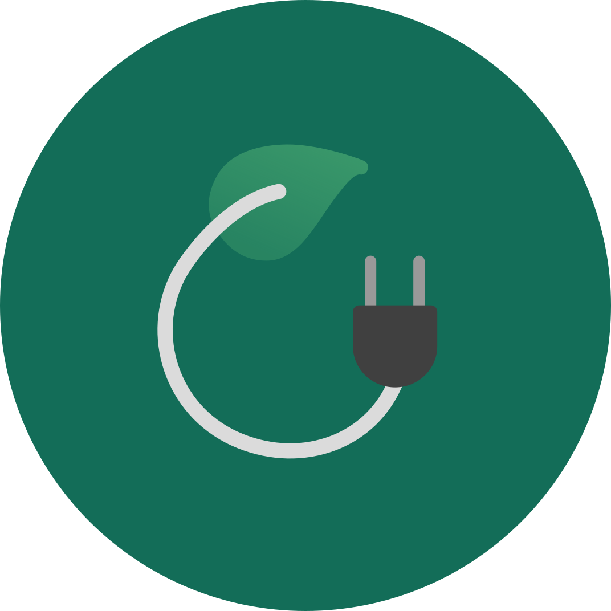

<h1 align="center">
  
   
  Gardim MVP
   
</h1>

<h4 align="center"> Produto Viável Mínimo do Gardim, aplicativo que notifica e informa o usuário sobre quais os melhores cuidados necessários para garantir a saúde da planta.</h4>

  <a href="#sobre">Sobre</a> •
  <a href="#funcionalidades">Funcionalidades</a> •
  <a href="#mais-informações">Mais Informações</a> •
  <a href="#%EF%B8%8F-licença">Licença</a>

## Sobre
O Gardim é um aplicativo que juntamente a um vaso inteligente, auxilia no cultivo dentro de apartamentos. Essa é uma versão mínima do produto, criada para auxiliar na validação do produto final.

## Funcionalidades
+ Vaso inteligente;
+ Sensor de humidade;
+ Notificação de status da planta;

## Mais Informações
Para mais informações sobre o projeto, por favor leia a página [Wiki](https://github.com/gardim/gardim/wiki).

## ⚖️ Licença
[GNU General Public License v3.0](https://github.com/gardim/gardim-mvp/blob/main/LICENSE)
